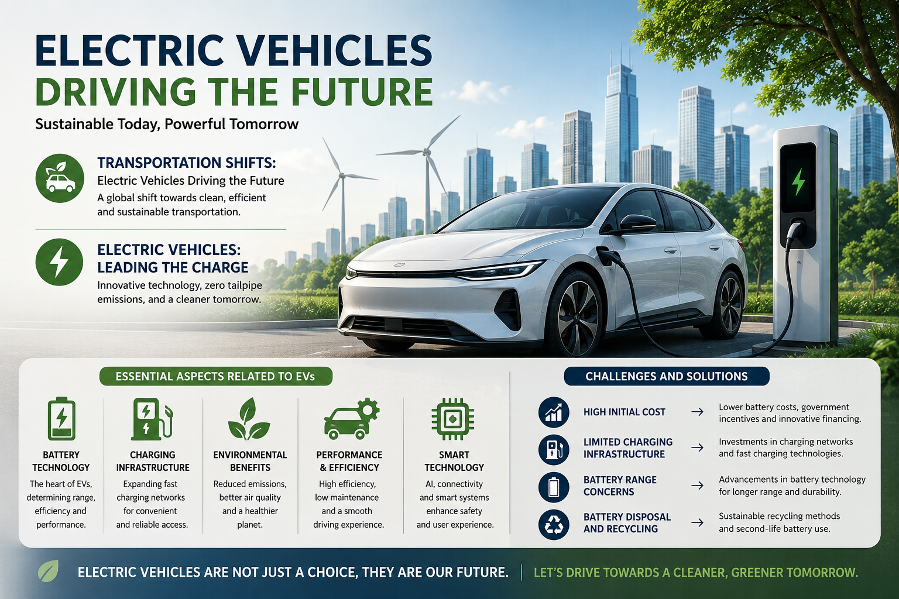

# Energy Efficiency: A Pathway to Sustainable Living 🌱⚡

## Overview

Energy efficiency plays a crucial role in creating a sustainable future by reducing energy consumption, minimizing environmental impacts, and promoting responsible use of resources.

This article explores how sustainable practices and technological innovations can contribute to a cleaner and greener future, with a special focus on the transformation of transportation through **Electric Vehicles (EVs)**.

## Topics Covered

### 🚗 Transportation Shifts: Electric Vehicles Driving the Future

The transportation sector is undergoing a major transformation due to the need to reduce fossil fuel dependency and greenhouse gas emissions. Electric vehicles are emerging as a cleaner and more energy-efficient alternative to conventional vehicles.

### ⚡ Electric Vehicles: Leading the Charge

This section discusses how EVs support sustainable transportation through:

* Zero tailpipe emissions
* Advancements in battery technology
* Improved driving range and charging efficiency
* Reduced dependence on fossil fuels

### 🔋 Essential Aspects Related to Electric Vehicles (EVs)

Key areas explored:

* Battery technology and sustainability
* Charging infrastructure development
* Environmental benefits
* Manufacturing impacts
* Recycling and lifecycle management
* Future EV innovations

### ⚙️ Challenges and Solutions

The transition to electric mobility faces several challenges, including:

* Limited charging infrastructure
* Battery production and recycling concerns
* High initial vehicle costs
* Public awareness and adoption barriers

Possible solutions include improved charging networks, sustainable battery technologies, government incentives, and increased consumer awareness.

## Key Message

Electric vehicles represent an important step toward sustainable transportation. With continued innovation, renewable energy integration, and collaborative efforts, EVs can contribute significantly to reducing emissions and building a cleaner future.

## Article

📄 Full article available here:

[Energy Efficiency: A Pathway to Sustainable Living](Energy_Efficiency_A_Pathway_to_Sustainable_Living.pdf)

## Author

**Sudharshini Kannan**

Bioinformatics & Computational Biology | Data Analyst | Molecular Biology

## References

The article includes references from organizations and research sources including EPA, IEA, MIT, and other scientific publications.
